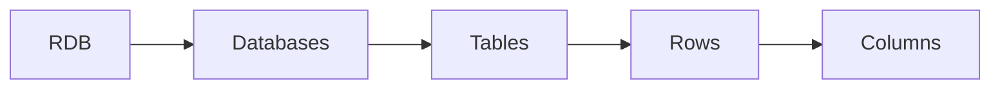
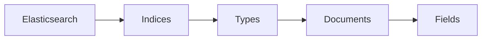

# Elasticsearch

[TOC]

## 基础入门

### 是什么

- 实时分布式搜索和分析引擎
- 用于全文搜索、结构化搜索、分析以及将这三者混合使用

### 安装

#### es的安装

官网下载elasticsearch-2.x或者5.x，解压，然后运行`bin/elasticsearch`，就能启动服务，浏览器输`http://localhost:9200`访问，看到一个json结果集，就表示安装成功。

```json
{
  "name" : "...",
  "cluster_name" : "elasticsearch",
  "version" : {
     "number" : "...",
     "build_hash" : "...",
     "build_timestamp" : "...",
     "build_snapshot" : false,
     "lucene_version" : "..."
  },
  "tagline" : "You Know, for Search"
}
```

#### es插件的安装

- head插件  
    1. 在线安装：`plugin install mobz/elasticsearch-head`
    2. 离线安装：下载压缩包，解压到plugins目录下，改名为sense
    3. 访问：`http://localhost:9200/_plugin/head`

#### kibana的安装

- 为Logstash和ElasticSearch提供日志分析的Web界面  
- Kibana是一个与ES以前工作的开源分析、可视化平台，使用Kibana可以查询、查看并与存储在ES索引的数据进行交互操作，使用Kibana能执行高级的数据分析，并能以图表、表格和地图的形式查看数据。
- 官网下载kibana-4.x或者5.x，kibana-4.x对应elasticsearch-2.x，kibana-5.x对应elasticsearch-5.x，修改`config/kibana.yml`中的`elasticsearch.url`指向elasticsearch的地址，运行`bin/kinbana`，就能启动服务，浏览器输`http://localhost:5601`访问kibana。

#### kibana插件的安装

- Sense插件：Sense是一个Kibana应用 它提供交互式的控制台，通过你的浏览器直接向Elasticsearch提交请求
  - 在线安装：`./bin/kibana plugin --install elastic/sense`
  - 离线安装：下载压缩包，解压丢到installedPlugins目录下，改名为sense
  - 访问：`http://localhost:5601/app/sense`

### 面向文档

储存整个对象或者文档，json

### 索引

与传统关系型数据库对比：





Elasticsearch集群可以包含多个索引(Indices)（数据库），每一个索引可以包含多个类型(Types)（表），每一个类型包含多个文档(Documents)（行），每一个文档包含多个字段(Fields)（列）

```json
PUT /索引名/类型名/文档
{
    "xx" : "xx",
    "xx" : "xx",
    "xx" : ["xx", "xx"]
}
```

### 搜索
#### 检索文档
执行GET请求并指出文档的地址——索引、类型、文档。根据这些信息可以返回原始JSON文档。
`GET /xx/xx/xx`

#### 简单搜索
在GET方法结尾使用关键字`_search`，带参数`_search?q=xx:xx`

#### 使用DSL语句
DSL(Domain Specific Language)特定领域语言
```
GET /xx/.../xx/_search
{
    "query" : {
        ...
    }
}
```
- 普通搜索
- 带过滤的搜索
- 全文搜索
- 短语搜索

### 聚合
在数据上生成复杂的分析统计
```
GET /xx/.../xx/_search
{
    "aggs" : {
        ...
    }
}
```

## Java API

### Transport Client
与es建立连接
```Java
// on startup
TransportClient client = TransportClient.builder().build()
        .addTransportAddress(new InetSocketTransportAddress(InetAddress.getByName("host1"), port))
        .addTransportAddress(new InetSocketTransportAddress(InetAddress.getByName("host2"), port));

// example，端口一般为9300
TransportClient client = TransportClient.builder().build()
        .addTransportAddress(new InetSocketTransportAddress(InetAddress.getByName("localhost"), 9300));

// on shutdown
client.close();
```

### Document APIs

#### Index API
输入数据
- Manually (aka do it yourself) using native byte[] or as a String（要注意date等对象类型的格式）
```Java
String json = "{" +
    "\"user\":\"kimchy\"," +
    "\"postDate\":\"2013-01-30\"," +
    "\"message\":\"trying out Elasticsearch\"" +
"}";

IndexResponse response = client.prepareIndex("twitter", "tweet")
        .setSource(json)
        .get();
```
- Using a Map that will be automatically converted to its JSON equivalent
```Java
Map<String, Object> json = new HashMap<String, Object>();
json.put("user","kimchy");
json.put("postDate",new Date());
json.put("message","trying out Elasticsearch");

IndexResponse response = client.prepareIndex("twitter", "tweet")
        .setSource(json)
        .get();
```
- Using a third party library to serialize your beans such as Jackson
```

```
- Using built-in helpers XContentFactory.jsonBuilder()，一般使用这种
```Java
import static org.elasticsearch.common.xcontent.XContentFactory.*;

XContentBuilder builder = jsonBuilder()
    .startObject()
        .field("user", "kimchy")
        .field("postDate", new Date())
        .field("message", "trying out Elasticsearch")
    .endObject();
    
IndexResponse response = client.prepareIndex("twitter", "tweet")
        .setSource(builder)
        .get();    
        
// or
String json = builder.string();
IndexResponse response = client.prepareIndex("twitter", "tweet")
        .setSource(json)
        .get();
```

#### Get API
查找数据
```Java
GetResponse response = client.prepareGet("twitter", "tweet", "1").get();
```

#### Delete API
删除数据
```Java
DeleteResponse response = client.prepareDelete("twitter", "tweet", "1").get();
```

#### Update API
更新数据（没有的会插入）
- Create an UpdateRequest and send it to the client
```Java
UpdateRequest updateRequest = new UpdateRequest();
updateRequest.index("xx");
updateRequest.type("xx");
updateRequest.id("xx");
updateRequest.doc(String, Map, XContentBuilder...);
client.update(updateRequest).get();
```
- Use prepareUpdate() method
```Java
client.prepareUpdate(index, type, id)
        .setDoc(String, Map, XContentBuilder...)
        .get();
```

### 搜索API
boolQuery()  
```json
{
   "bool" : {
      "must" :     [],
      "should" :   [],
      "must_not" : [],
   }
}
```
- must：所有的语句都 必须（must） 匹配，与 AND 等价。
- must_not：所有的语句都 不能（must not） 匹配，与 NOT 等价。
- should：至少有一个语句要匹配，与 OR 等价。

```json
{
    "bool" : {
        "must" : [
            {
                "range" : {
                    
                }
            },
            {
                "term": {
                    
                }
            },
            "一些条件"
    ],
        "should" : [],
        "must_not" : [],
    }
}
```
## API
Java API [2.3] » Query DSL 部分

## 深入
### 数据类型

#### 核心数据类型(Core datatypes)
- 字符型(String datatype): string
- 数字型(Numeric datatypes): long, integer, short, byte, double, float
- 日期型(Date datatype): date
- 布尔型(Boolean datatype): boolean
- 二进制型(Binary datatype): binary

#### 复杂数据类型(Complex datatypes)
- 数组类型(Array datatype): 数组类型不需要专门指定数组元素的type
- 对象类型(Object datatype): object用于单个JSON对象
- 嵌套类型(Nested datatype): nested用于JSON数组

#### 地理位置类型(Geo datatypes)
- 地理坐标类型(Geo-point datatype): geo_point用于经纬度坐标
- 地理形状类型(Geo-Shape datatype): geo_shape用于类似于多边形的复杂形状

#### 特定类型(Specialised datatypes)
- IPv4 类型(IPv4 datatype): ip用于IPv4地址
- Completion类型(Completion datatype): completion提供自动补全建议
- Token count类型(Token count datatype): token_count用于统计做了标记的字段的index数目，该值会一直增加，不会因为过滤条件而减少
- mapper-murmur3类型：通过插件，可以通过murmur3来计算index的hash值
- 附加类型(Attachment datatype): 采用mapper-attachments插件，可支持attachments索引，例如Microsoft Office格式，Open Document 格式，ePub，HTML等。

## 搜索
### 基本查询
1. 词条查询：仅匹配在给定字段中含有该词条的文档，而 且是**确切的、未经分析的**词条
```json
{
    "query" : {
        "term" : {}
    }
}
```
2. 多词条查询
```json
{
    "query" : {
        "terms" : {}
    }
}
```
3. match\_all查询：匹配索引中的**所有**文件
```json
{
    "query" : {
        "match_all" : {}
    }
}
```
4. 常用词查询
5. match查询：把query参数中的值拿出来，**加以分析**，然后构建相应的查询
```json
{
    "query" : {
        "match" : {}
    }
}
```
6. mutil\_match查询：它不是针对单个字段，可以通过fields参数针对**多个字段**查询
```json
{
    "query" : {
        "multi_match" : {}
    }
}
```
7. query\_string查询：query\_string查询支持全部的**Apache Lucene查询语法**
```json
{
    "query" : {
        "query_string" : {
            "query" : "title:crime^10 +title:punishment -otitle:cat +author:(+Fyodor +dostoevsky)",
            "default_field" : "title"
        }
    } 
}
```
8. simple\_query\_string查询：类似query\_string查询，接受Lucene查询语法；然而不同的是，simple\_query\_string查询在解析错误时不会抛出异常
```json
{
    "query" : {
        "simple_query_string" : {
            "query" : ""
        }
    } 
}
```
9. 标识符查询：仅用提供的**标识符**来过滤返回的文档
```json
{
    "query" : {
        "ids" : {
            "values" : [ "10", "11", "12", "13" ]
        } 
    }
}
```
10. 前缀查询
```json
{
    "query" : {
        "prefix" : {
          "title" : "cri"
        } 
    }
}
```
11. fuzzy\_like\_this查询
12. fuzzy\_like\_this\_field查询
13. fuzzy查询：基于编辑距离算法来匹配文档
14. 通配符查询：在查询值中使用*和?等通配符
15. more\_like\_this查询
16. more\_like\_this\_field查询
17. 范围查询
    - gte: 范围查询将匹配字段值大于或等于此参数值的文档。  
    - gt: 范围查询将匹配字段值大于此参数值的文档。
    - lte: 范围查询将匹配字段值小于或等于此参数值的文档。  
    - lt: 范围查询将匹配字段值小于此参数值的文档。
```json
{
    "query" : {
        "range" : {
            "year" : {
            "gte" : 1700,
            "lte" : 1900
            } 
        }
    } 
}
```
18. 最大分查询
19. 正则表达式查询：使用正则表达式来查询文本
```json
{
    "query" : {
        "regexp" : {}
    }
}
```

### 复合查询
1. 布尔查询
    - should: 被它封装的布尔查询可能被匹配(OR)，也可能不被匹配。被匹配的should节点数目 由minimum\_should\_match参数控制。
    - must: 被它封装的布尔查询必须被匹配(AND)，文档才会返回。
    - must_not: 被它封装的布尔查询必须不被匹配(NOT)，文档才会返回。
```json
{
    "query" : {
        "bool" : {
            "should" : [{}, {}, ...],
            "must" : [{}, {}, ...],
            "must_not" : [{}, {}, ...]
        }
    }
}      
```
2. 加权查询：封装了两个查询，并且降低其中一个查询返回文档的得分  
加权查询中有三个节点需要定义：
    - positive部分，包含所返回文档得分不会被改变的查询;
    - negative部分，返回的文档得分将被降低;
    - negative_boost部分，包含用来降低negative部分查询得分的加权值。
```json
{
    "query" : {
        "boosting" : {
            "positive" : {
                "term" : {
                    "title" : "crime"
                }
            },
            "negative" : {
                "range" : {
                    "year" : {
                        "from" : 1800,
                        "to" : 1900 
                    }
                } 
            },
            "negative_boost" : 0.5
        } 
    }
}
```

3. constant\_score查询：constant\_score查询封装了另一个查询(或过滤)，并为每一个所封装查询(或过滤)返 回的文档返回一个常量得分。
```json
{
    "query" : {
        "constant_score" : {
            "query" : {
                "term" : {
                    "title" : "crime"
                }
            },
            "boost" : 2.0
        }
    } 
}
```
4. 索引查询

### 查询结果的过滤

1. 使用过滤器
2. 过滤器类型
3. 过滤器的缓存
